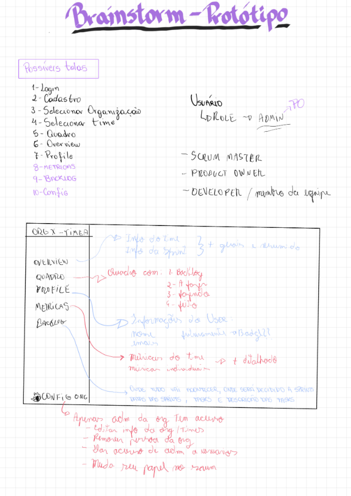

## Prototipagem iterativa

### O que é?

A prototipagem iterativa é um processo fundamental no desenvolvimento de interfaces e experiências digitais. Consiste na construção progressiva de protótipos, começando com versões de baixa fidelidade e evoluindo gradualmente para protótipos de média e alta fidelidade, mais próximos do produto final.

Este método permite:
- **Validação antecipada** de conceitos e ideias antes do desenvolvimento
- **Redução de custos** ao identificar problemas de usabilidade precocemente
- **Feedback contínuo** dos usuários e stakeholders
- **Refinamento progressivo** da solução com base em dados reais

### Processo de trabalho

1. **Ideação e Brainstorming**: Geração de ideias e conceitos iniciais
2. **Prototipagem de baixa fidelidade**: Esboços básicos
3. **Prototipagem de média/alta fidelidade**: Protótipos navegáveis e interativos

---

### Brainstorming do protótipo 

Nesta fase inicial, exploramos diferentes ideias e conceitos através de sessões de brainstorming colaborativo. O objetivo era gerar o máximo de alternativas possíveis antes de convergir para uma solução específica.

*Figura 1: Sessão de brainstorming com ideias e conceitos explorados*

---

### 🎨 Acesse o Protótipo

Explore abaixo o protótipo interativo desenvolvido no Figma. O protótipo permite navegar pelos principais fluxos e interações propostos para a solução.

👉 **[Acessar Protótipo no Figma](https://www.figma.com/proto/ort3Dd5P08hU7DmBTX276s/TCC?page-id=102%3A227&node-id=4527-1480&p=f&viewport=381%2C129%2C0.39&t=NOdwKtJL0CRFieJR-1&scaling=contain&content-scaling=fixed&starting-point-node-id=4527%3A1480)**
